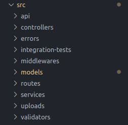

# Sumário

- [Sumário](#sumário)
- [Boas vindas à API Cookmaster](#boas-vindas-à-api-cookmaster)
- [Instalação](#instalação)
  - [Habilidades Desenvolvidas com a realização do projeto:](#habilidades-desenvolvidas-com-a-realização-do-projeto)
  - [Caracteristicas da API:](#caracteristicas-da-api)
  - [Arquitetura:](#arquitetura)
  - [!Arquitetura](#)
  - [Coleções](#coleções)
  - [Linter](#linter)
  - [Testes](#testes)
- [Endpoints](#endpoints)
- [A ser implementado:](#a-ser-implementado)

# Boas vindas à API Cookmaster

Essa API foi desenvolvida durante o bloco 28 do bootcamp de Desenvolvimento Web Full Stack da Trybe. Neste bloco estudamos autenticação com JWT e upload de arquivos com multer, além de consolidar todo o conhecimento relacionado à arquitetura MSC.
# Instalação
1. Use o comando `git clone` + link do repositório em:
- HTTPS: `https://github.com/markyangit/cookmaster-api.git`
- SSH: `git@github.com:markyangit/cookmaster-api.git`

2. Mude para a pasta do projeto utilizando o comando `cd cookmaster-api`, no linux.
3. Dentro da pasta, utilize o comando `npm run dev` para iniciar o servidor node. Algumas observações:
- Lembre-se de iniciar a instância do MongoDB na sua máquina, para o Node conseguir acessar o banco de dados.
- No caminho `/src/models` existe um arquivo chamado `index.js`, onde encontra-se toda a conexão com o banco utilizando `Mongoose`. Você perceberá que na URL do MongoDB existem algumas variáveis de ambiente que podem ser configuradas no arquivo `.env`, na pasta raíz. Configure-os de acordo com sua máquina.

4. Para acessar os endpoints, basta utilizar o Insomnia, Postman ou o próprio navegador, inserindo na URL o endereço onde está rodando seu servidor. Por padrão, ele roda na porta 3000, então você pode acessar em `http://localhost:3000/`.


## Habilidades Desenvolvidas com a realização do projeto:

- Entender o que há por dentro de um token de autenticação;

- Gerar tokens a partir de informações como login e senha;

- Autenticar rotas do Express, usando o token JWT;

- Fazer upload de arquivos em APIs REST;

- Salvar arquivos no servidor através de uma API REST;

- Consultar arquivos do servidor através de uma api REST.

## Caracteristicas da API:
- CRUD completo de Receitas e Usuários;
- Autenticação com JWT;
- Upload de arquivos usando multer;
- Projeto inteiramente feito na arquitetura MSC.

## Arquitetura:

---
## Coleções

O banco terá duas coleções: usuários e receitas.

A coleção de usuários é chamada de: `users`.

Os campos da coleção `users` terão este formato:

```json
{ "name" : "Erick Jacquin", "email" : "erickjacquin@gmail.com", "password" : "12345678", "role" : "user" }
```


A coleção de receitas é chamada de: `recipes`.

Os campos da coleção `recipes` terão este formato:

```json
{ "name" : "Receita do Jacquin", "ingredients" : "Frango", "preparation" : "10 minutos no forno" }
```

## Linter

Usei o [ESLint](https://eslint.org/) para fazer a análise estática do código.

Este projeto já vem com as dependências relacionadas ao _linter_ configuradas no arquivos `package.json`.

Para poder rodar os `ESLint` em um projeto basta executar o comando `npm install` dentro do projeto e depois `npm run lint`. Se a análise do `ESLint` encontrar problemas no seu código, tais problemas serão mostrados no seu terminal. Se não houver problema no seu código, nada será impresso no seu terminal.

Você pode também instalar o plugin do `ESLint` no `VSCode`, bastar ir em extensions e baixar o [plugin `ESLint`](https://marketplace.visualstudio.com/items?itemName=dbaeumer.vscode-eslint).

## Testes

Para executar os testes localmente, digite no terminal o comando `npm test`.

# Endpoints

1. #### PUT /users - cadastro de novos usuários:

**As seguintes verificações são feitas:**

- **Será validado que o campo "name" é obrigatório**

Se o usuário não tiver o campo "name" o resultado retornado deverá ser conforme exibido abaixo, com um status http `400`:


- **Será validado que o campo "email" é obrigatório**

Se o usuário não tiver o campo "email" o resultado retornado deverá ser conforme exibido abaixo, com um status http `400`:


- **Será validado que não é possível cadastrar usuário com o campo email inválido**

Se o usuário tiver o campo email inválido o resultado retornado deverá ser conforme exibido abaixo, com um status http `400`:


- **Será validado que o campo "senha" é obrigatório**

Se o usuário não tiver o campo "senha" o resultado retornado deverá ser conforme exibido abaixo, com um status http `400`:


- **Será validado que o campo "email" é único**

Se o usuário cadastrar o campo "email" com um email que já existe, o resultado retornado deverá ser conforme exibido abaixo, com um status http `409`:


- **Será validado que é possível cadastrar usuário com sucesso**

Se o usuário for cadastrado com sucesso o resultado retornado deverá ser conforme exibido abaixo, com um status http `201`:


1. #### POST /login - login de usuários:

**As seguintes verificações são feitas:**

- **Será validado que o campo "email" é obrigatório**

Se o login não tiver o campo "email" o resultado retornado deverá ser conforme exibido abaixo, com um status http `401`:


- **Será validado que o campo "password" é obrigatório**

Se o login não tiver o campo "password" o resultado retornado deverá ser conforme exibido abaixo, com um status http `401`:


- **Será validado que não é possível fazer login com um email inválido**

Se o login tiver o email inválido o resultado retornado deverá ser conforme exibido abaixo, com um status http `401`:


- **Será validado que não é possível fazer login com uma senha inválida**

Se o login tiver a senha inválida o resultado retornado deverá ser conforme exibido abaixo, com um status http `401`:


- **Será validado que é possível fazer login com sucesso**

Se foi feito login com sucesso o resultado retornado deverá ser conforme exibido abaixo, com um status http `200`:


1. POST /recipes - cadastro de novas receitas:

**As seguintes verificações são feitas:**

- **Será validado que não é possível cadastrar receita sem o campo "name"**

Se a receita não tiver o campo "name" o resultado retornado deverá ser conforme exibido abaixo, com um status http `400`:


- **Será validado que não é possível cadastrar receita sem o campo "ingredients"**

Se a receita não tiver o campo "ingredients" o resultado retornado deverá ser conforme exibido abaixo, com um status http `400`:


- **Será validado que não é possível cadastrar receita sem o campo "preparation"**

Se a receita não tiver o campo "preparation" o resultado retornado deverá ser conforme exibido abaixo, com um status http `400`:


- **Será validado que não é possível cadastrar uma receita com token invalido**

Se a receita não tiver o token válido o resultado retornado deverá ser conforme exibido abaixo, com um status http `401`:


- **Será validado que é possível cadastrar uma receita com sucesso**

O resultado retornado para cadastrar a receita com sucesso deverá ser conforme exibido abaixo, com um status http `201`:


4. GET /recipes - lista todas as receitas cadastradas:

**As seguintes verificações são feitas:**

- **Será validado que é possível listar todas as receitas sem estar autenticado**

O resultado retornado para listar receitas com sucesso deverá ser conforme exibido abaixo, com um status http `200`:


- **Será validado que é possível listar todas as receitas estando autenticado**

O resultado retornado para listar receitas com sucesso deverá ser conforme exibido abaixo, com um status http `200`:


5. GET /recipes/:id - listar uma receita específica.

**As seguintes verificações são feitas:**

- **Será validado que é possível listar uma receita específica sem estar autenticado**

O resultado retornado para listar uma receita com sucesso deverá ser conforme exibido abaixo, com um status http `200`:


- **Será validado que é possível listar uma receita específica estando autenticado**

O resultado retornado para listar uma receita com sucesso deverá ser conforme exibido abaixo, com um status http `200`:


- **Será validado que não é possível listar uma receita que não existe**

O resultado retornado para listar uma receita que não existe deverá ser conforme exibido abaixo, com um status http `404`:


6. PUT /recipes/:id - editar uma receita cadastrada:

**As seguintes verificações são feitas:**

- **Será validado que não é possível editar receita sem estar autenticado**

O resultado retornado para editar receita sem autenticação deverá ser conforme exibido abaixo, com um status http `401`:


- **Será validado que não é possível editar receita com token inválido**

O resultado retornado para editar receita com token inválido deverá ser conforme exibido abaixo, com um status http `401`:


- **Será validado que é possível editar receita estando autenticado**

O resultado retornado para editar uma receita com sucesso deverá ser conforme exibido abaixo, com um status http `200`:


- **Será validado que é possível editar receita com usuário admin**

O resultado retornado para editar uma receita com sucesso deverá ser conforme exibido abaixo, com um status http `200`:


7. DELETE /recipes/:id - exclusão de uma receita:

**As seguintes verificações são feitas:**

- **Será validado que não é possível excluir receita sem estar autenticado**

O resultado retornado para excluir uma receita sem autenticação deverá ser conforme exibido abaixo, com um status http `401`:


- **Será validado que é possível excluir receita estando autenticado**

O resultado retornado para excluir uma receita com sucesso deverá ser conforme exibido abaixo, com um status http `204`:


- **Será validado que é possível excluir receita com usuário admin**

O resultado retornado para excluir uma receita com sucesso deverá ser conforme exibido abaixo, com um status http `204`:


8. PUT /recipes/:id/image - adicionar uma imagem à receita:

**As seguintes verificações são feitas:**

- **Será validado que é possível enviar foto com usuário autenticado**

O resultado retornado para adicionar uma foto na receita com sucesso deverá ser conforme exibido abaixo, com um status http `200`:


- **Será validado que ao enviar foto, o nome da imagem é alterada para o id da receita**

O resultado retornado para adicionar uma foto na receita com sucesso deverá ser conforme exibido abaixo, com um status http `200`:


- **Será validado que não é possível enviar foto sem estar autenticado**

O resultado retornado para adicionar uma foto na receita com sucesso deverá ser conforme exibido abaixo, com um status http `401`:


- **Será validado que é possível enviar foto com usuário admin**

O resultado retornado para adicionar uma foto na receita com sucesso deverá ser conforme exibido abaixo, com um status http `200`:


# A ser implementado:
- Endpoint de consulta de imagens de receitas;
- Finalizar o padrão REST.


*Parte desse readme foi feito com base no readme do projeto original para a turma 12 da Trybe. Todos os direitos são reservados.*